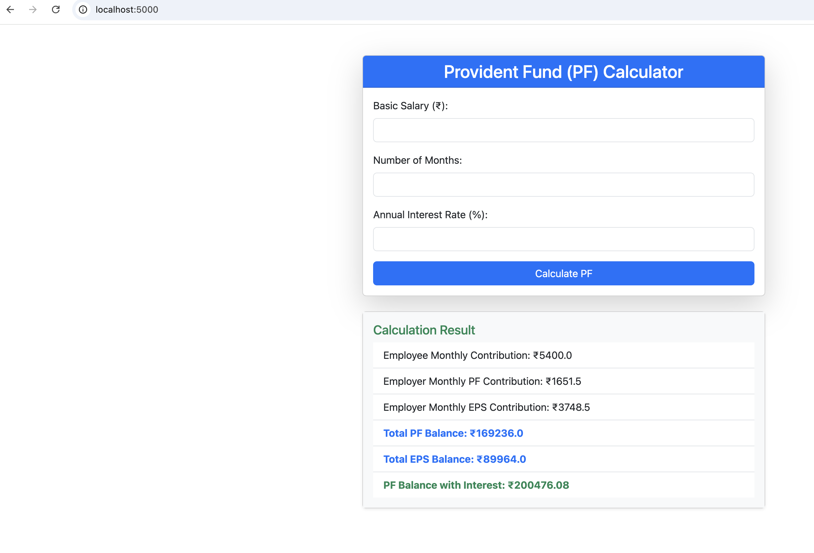

# 🧮 Provident Fund (PF) Calculator Web App

A simple and responsive Flask-based web app to calculate Provident Fund (PF) balance, including employer/employee contributions and compound interest.



---

## 🚀 Features

- Calculate PF based on basic salary and number of months
- Includes both employee and employer contributions
- Option to enter interest rate for compound interest calculation
- Responsive Bootstrap UI
- Easy to deploy locally or on cloud platforms

---

## 📦 Requirements

- Python 3.9+
- Flask 3.1+

Install with:

```bash
pip install -r requirements.txt

## Running app
  python app.py

## License
MIT License — Free to use and modify.
